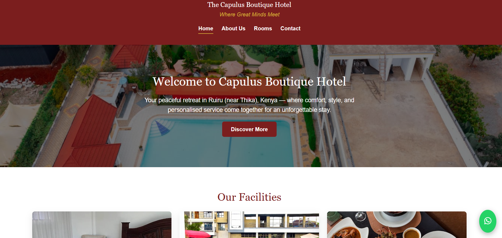
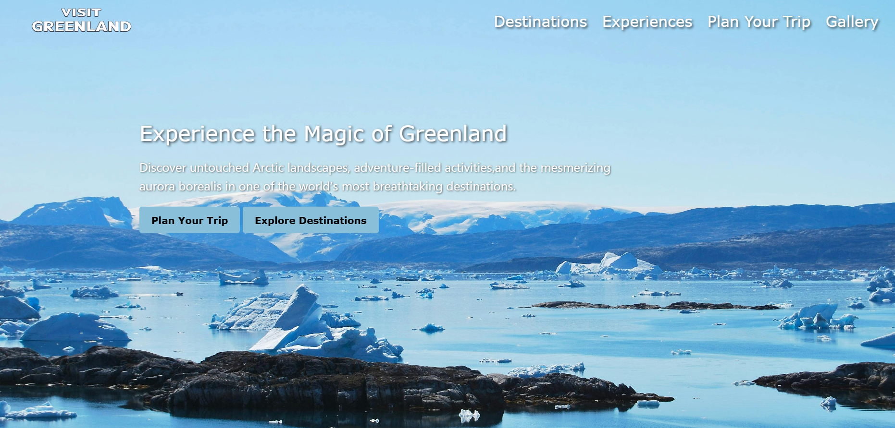
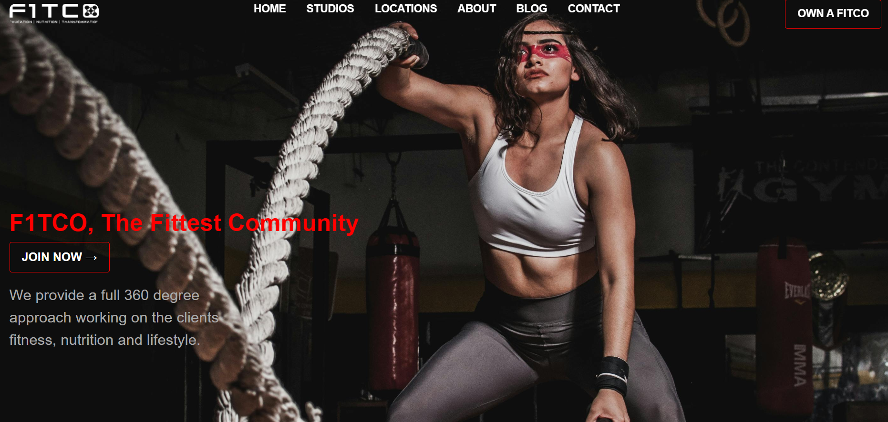

Arasha Lenana | Portfolio

Welcome to my personal portfolio! This website showcases my web development projects, technical skills, and contact information. It demonstrates my ability to create responsive, user-friendly, and business-focused websites.

🌐 Live Portfolio
Check it out here: (https://arashalenana.github.io/Portfolio/)

💻 Projects
1. Capulus Restaurant Website
- Responsive website showcasing rooms, swimming packages, and contact info.
- Live: [Capulus Boutique](https://capulusboutique.netlify.app/)
- Screenshot:
  

2. Greenland Homepage Website
- Homepage for Greenland highlighting scenic views and interactive features.
- Live: [Greenland Homepage](https://arashalenana.github.io/visit-greenland/)
- Screenshot:
  

3. Fitco Fitness Website
- Fitness center website showcasing gym facilities and contact details.
- Run locally with XAMPP.
- Screenshot:
  

🛠️ Tech Stack
- HTML5, CSS3, JavaScript
- Responsive design
- Basic PHP for backend projects (run locally with XAMPP if required)

📂 Structure
- `index.html` – Landing page / Home
- `skills.html` – Skills section
- `projects.html` – Projects showcase
- `contact.html` – Contact section
- `style.css` – Stylesheets
- `script.js` – JavaScript files
- `images/` – Project images and screenshots

📌 Features
- Responsive design for desktop and mobile
- Dark/Light mode toggle with preference saved
- Smooth scroll and animations
- Hamburger menu for small screens
- Skills bars with animated counters
- Interactive project cards with links

💡 Notes
- Some projects (like f1tco) require XAMPP to run locally for backend features.
- All live links are hosted via Netlify and Github for static projects.

📫 Contact Me
- Email: arashalenana@gmail.com  
- GitHub: [github.com/arashalenana](https://github.com/arashalenana)  
- LinkedIn: [linkedin.com/in/arashalenana](https://www.linkedin.com/in/ian-arasha-44b95931b/)
